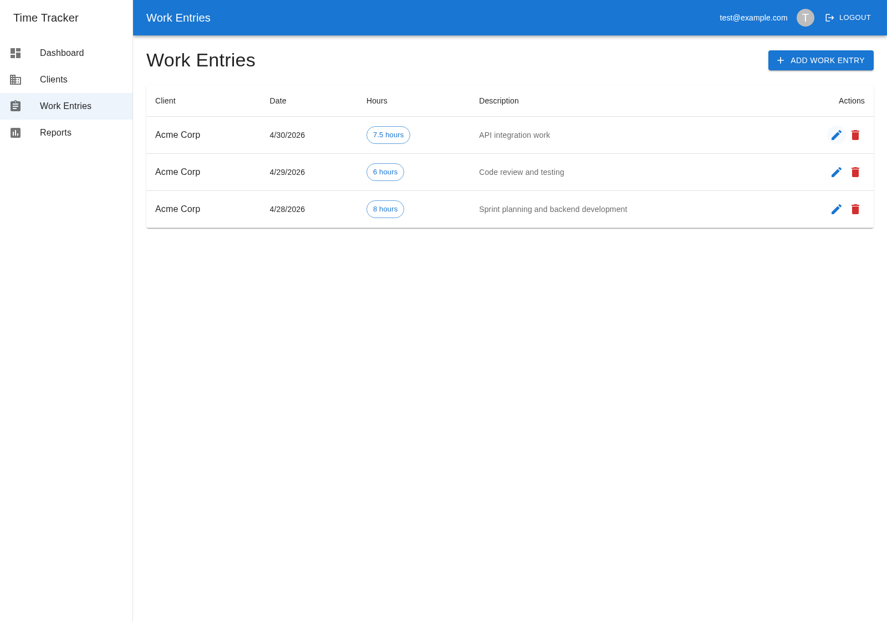
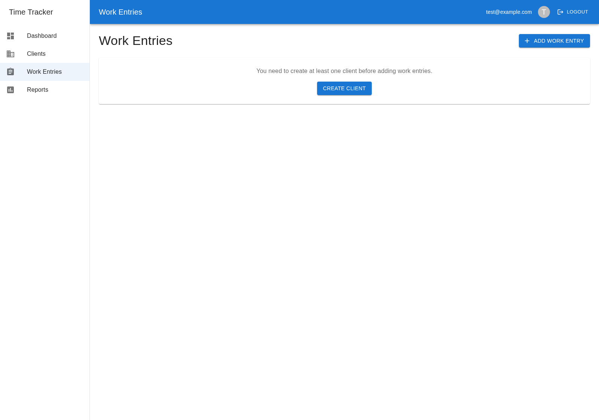
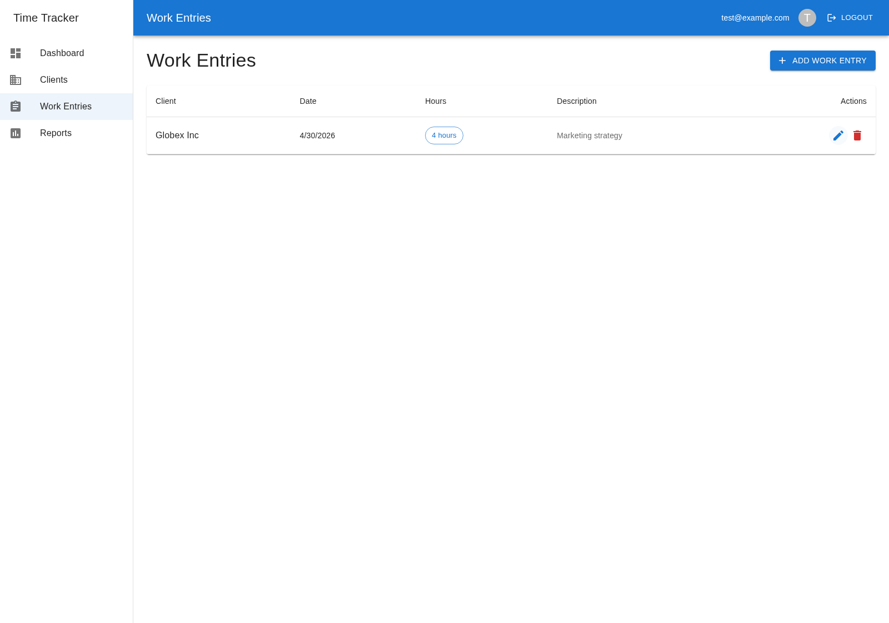

# Root Cause Analysis: Orphaned Work Entries on Client Deletion

## Bug Summary

When a client is deleted, their associated work entries are **not removed from the database** due to SQLite foreign key constraints not being enforced. This results in orphaned records that silently disappear from the UI (due to INNER JOIN queries) but remain in the database, causing data integrity issues and potential data leakage.

## Impact

- **Severity**: High
- **Affected features**: Client deletion (single and bulk "Delete All"), Dashboard stats, Work Entries list, Reports
- **User experience**: After deleting a client, work entries vanish from all views without explanation. Users expect either a warning that entries will be deleted, or for the data to be properly cleaned up. Instead, entries become invisible but persist as orphaned rows.
- **Data integrity**: Orphaned `work_entries` rows reference non-existent `client_id` values, violating referential integrity

## Root Cause

SQLite **disables foreign key enforcement by default**. The `PRAGMA foreign_keys` setting defaults to `OFF` for every new database connection. The application's schema correctly defines `ON DELETE CASCADE` constraints:

```sql
CREATE TABLE work_entries (
  ...
  FOREIGN KEY (client_id) REFERENCES clients (id) ON DELETE CASCADE
);
```

However, without explicitly enabling `PRAGMA foreign_keys = ON`, these constraints are **declarative only** — SQLite parses them but never enforces them.

**Location**: `backend/src/database/init.js` — the `getDatabase()` function creates the SQLite connection but never enables foreign key enforcement.

## Reproduction Steps (Before Fix)

1. Create a client (e.g., "Acme Corp")
2. Add work entries for that client (e.g., 8h, 6h, 7.5h)
3. Delete the client via the Clients page
4. Navigate to Work Entries — entries are gone from the UI
5. **However**, the work entry rows still exist in the database with `client_id` pointing to the now-deleted client

## The Fix

Added `PRAGMA foreign_keys = ON` immediately after creating the database connection in `getDatabase()`:

```javascript
function getDatabase() {
  if (!db) {
    db = new sqlite3.Database(':memory:', (err) => {
      if (err) {
        console.error('Error opening database:', err);
        throw err;
      }
      console.log('Connected to SQLite in-memory database');
    });
    // Enable foreign key enforcement (SQLite disables this by default)
    db.run('PRAGMA foreign_keys = ON');
  }
  return db;
}
```

**Why this location**: The PRAGMA must be set per-connection. By placing it in `getDatabase()` right after the connection is created, it guarantees enforcement regardless of which code path first accesses the database.

## Verification

After the fix:
- Deleting a client properly cascade-deletes all associated work entries
- Work entries for other clients remain unaffected
- All 161 existing backend tests continue to pass
- Frontend lint passes cleanly

## Before/After Screenshots

### Before: Work entries exist for Acme Corp (21.5 total hours)


### Before: After deleting client, entries silently disappear (orphaned in DB)


### After: Cascade properly deletes related entries, unrelated entries preserved


## Other Bugs Found During Exploration

1. **Cannot clear optional fields on edit**: The frontend sends `undefined` instead of empty string for cleared fields (description, department, email), so once set, these fields cannot be removed.
2. **Date timezone display issue**: Dates stored as ISO strings (e.g., "2026-04-30") are parsed with `new Date()` as UTC midnight, causing off-by-one display errors for users in negative UTC timezones.
